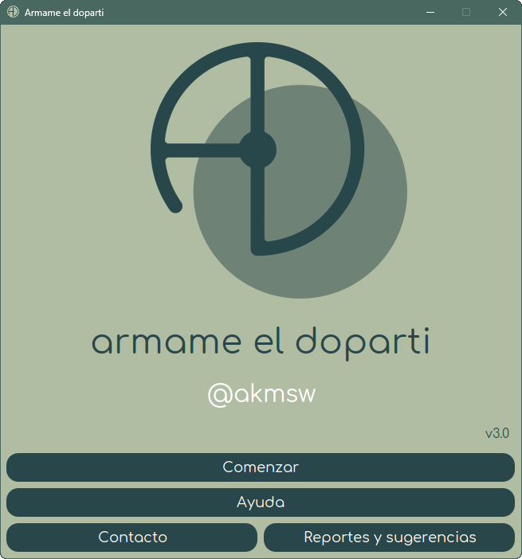
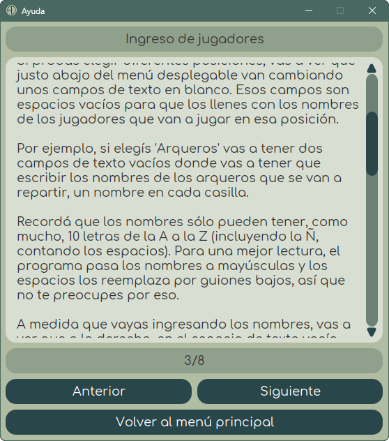
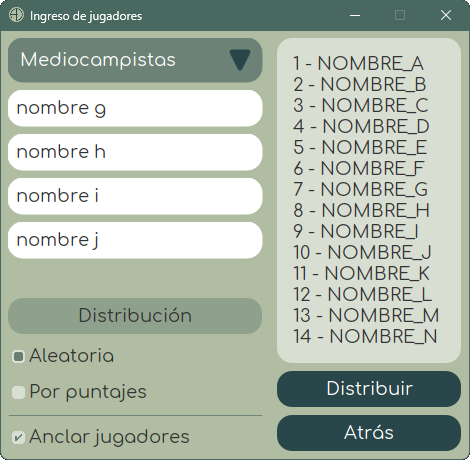
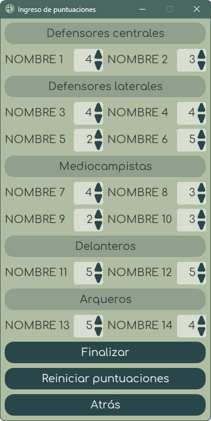
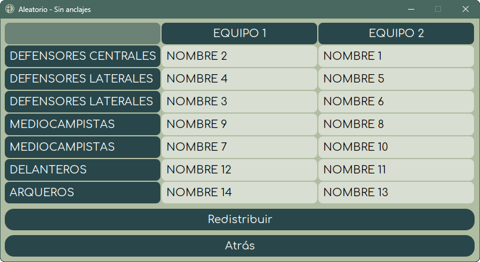
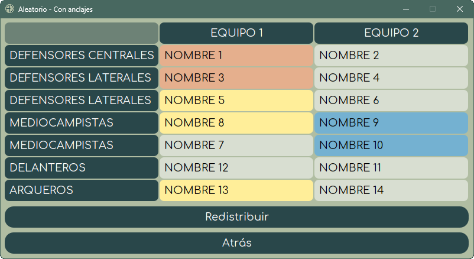
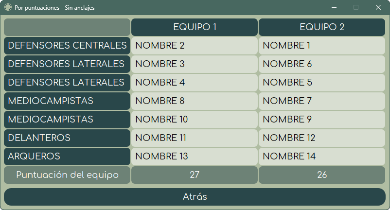
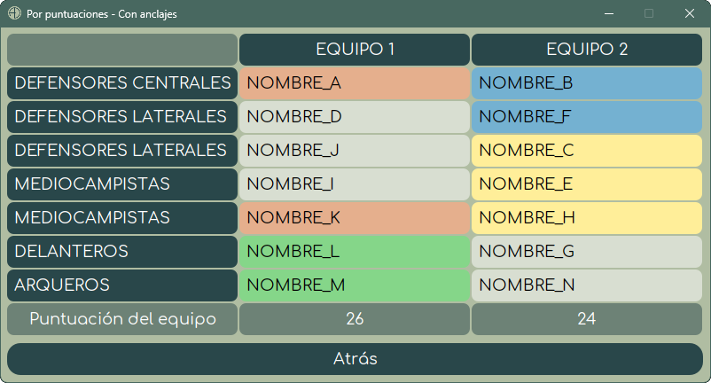

# ⚽ Armame el doparti []() []()


[](https://github.com/akmsw/armame-el-doparti/actions/workflows/maven.yml)
[](https://github.com/akmsw/armame-el-doparti/issues)

[](https://openjdk.org/projects/jdk/)
[](https://en.wikipedia.org/wiki/Cross-platform_software)
[](https://www.gnu.org/licenses/gpl-3.0.en.html)

<details>
  <summary>
    <h2 style="display:inline-block; border-bottom:none">🔎 ¿Qué es?</h2>
  </summary>

  Desarrollado completamente en Java y refactorizado en su totalidad, la nueva versión de este programa ofrece una rápida e intuitiva manera de generar equipos para partidos de fútbol 7, ya sea con distribución aleatoria de jugadores o basada en puntuaciones.\
  Se ofrece la posibilidad de "anclar" dos o más jugadores entre sí, garantizando de esta forma que queden en el mismo equipo sin importar el método de distribución elegido.
</details>

---

<details>
  <summary>
    <h2 style="display:inline-block; border-bottom:none">📦 Requisitos generales</h2>
  </summary>

  ### ☕ Java
  - #### Versión mínima
      🟡 [Java 23](https://jdk.java.net/23/)
  - #### Versión recomendada
      🟢 [Java 24](https://jdk.java.net/24/) *(o más reciente)*
</details>

---

<details>
  <summary>
    <h2 style="display:inline-block; border-bottom:none">⚙️ Requisitos para compilación manual</h2>
  </summary>

  ### 🪶 Apache Maven
  - #### Versión recomendada
      🟢 [Apache Maven 3.9.9](https://maven.apache.org/download.cgi) *(o más reciente)*
</details>

---

<details>
  <summary>
    <h2 style="display:inline-block; border-bottom:none">📥 Descarga</h2>
  </summary>

  Podés consultar el historial de versiones estables y betas en la sección [releases](https://github.com/akmsw/armame-el-doparti/releases) de este proyecto.
</details>

---

<details>
  <summary>
    <h2 style="display:inline-block; border-bottom:none">▶️ Instalación y ejecución</h2>
  </summary>

  Más allá de los requisitos listados, no hace falta ninguna instalación para correr este programa.\
  Una vez descargado el archivo `.jar`, e independientemente del sistema operativo que uses, podés dirigirte a la carpeta donde está situado y abrirlo con un simple *doble click*. En caso de que el programa no se abra, revisá la sección de solución a problemas frecuentes.\
  Si estás en Windows podés descargar el archivo `.exe` y abrirlo directamente con *doble click* también, ignorando el archivo `.jar`.\
  Una alternativa es abrir una terminal dentro de la carpeta contenedora del archivo y ejecutar el comando:
  ```bash
  java -jar armameeldoparti-3.0.0.jar
  ```
</details>

---

<details>
  <summary>
    <h2 style="display:inline-block; border-bottom:none">🛠️ Compilación manual y ejecución</h2>
  </summary>

  Para compilar manualmente el programa, asumiendo que instalaste correctamente tanto los requisitos generales como los requisitos para compilación manual, tenés que [descargar el proyecto en formato ZIP](https://github.com/akmsw/armame-el-doparti/archive/refs/heads/develop-v3.0.zip), extraer el archivo y, dentro de la carpeta extraída, ejecutar Apache Maven haciendo uso del archivo `pom.xml` mediante la terminal, con el siguiente comando:
  ```bash
  mvn package --file pom.xml
  ```
  o, simplemente:
  ```bash
  mvn package
  ```
  Esto va a crear una carpeta llamada `target` a la cual tenés que entrar. Ahí va a estar el archivo ejecutable en formato `.jar`. Para correr el programa se le puede hacer doble click o ejecutar, mediante la terminal, el comando indicado anteriormente:
  ```bash
  java -jar armameeldoparti-3.0.0.jar
  ```
</details>

---

<details>
  <summary>
    <h2 style="display:inline-block; border-bottom:none">📝 ¿Cómo se usa?</h2>
  </summary>

  Primero vas a tener que ingresar los nombres de los jugadores a sortear en cada posición.\
  La distribución estándar de jugadores por equipo es:
  - **Defensores centrales**: 1
  - **Defensores laterales**: 2
  - **Mediocampistas**: 2
  - **Delanteros**: 1
  - **Arqueros**: 1

  Una vez ingresados los nombres de todos los jugadores a repartir en cada posición para ambos equipos, vas a poder seleccionar si distribuirlos de manera aleatoria o en base a una puntuación.\
  Si elegís la segunda opción, vas a tener que ingresar una puntuación de 1 ***(mal jugador)*** a 5 ***(excelente jugador)*** para cada uno.\
  Finalmente, los equipos se van a armar de la manera más equitativa posible.\
  Si los jugadores se reparten en base a sus puntuaciones, la distribución óptima va a ser única. Si se los reparte de manera aleatoria, vas a poder redistribuirlos tantas veces como quieras.
</details>

---

<details>
  <summary>
    <h2 style="display:inline-block; border-bottom:none">⭐ Nuevas funcionalidades</h2>
  </summary>

  ### 🔗 Anclaje de jugadores
  El objetivo de esta funcionalidad es la de indicarle al programa que al menos dos jugadores seleccionados por el usuario tienen que estar en el mismo equipo sin importar la distribución que se elija para el resto. El número máximo posible de jugadores a anclar a un mismo equipo es de 6, garantizando así que siempre queden al menos dos jugadores sin anclar para poder realizar alguna distribución.\
  Para esto, hay una casilla rotulada con el texto "*Anclar jugadores*" en la ventana de ingreso de nombres. Si tildás esta casilla, luego de seleccionar el método de distribución de jugadores, vas a ver una ventana con una lista con todos los nombres ingresados, cada uno con una casilla similar asignada. Los jugadores cuya casilla esté tildada van a ser anclados al mismo equipo.\
  No se pueden anclar a un mismo equipo todos los jugadores de un mismo tipo (por ejemplo, si se anclan todos los mediocampistas para un mismo equipo, el otro equipo no va a tener mediocampistas y esto no es posible). Lo mismo sucede con anclar a un mismo equipo más de la mitad de jugadores registrados para una posición particular.
</details>

---

<details>
  <summary>
    <h2 style="display:inline-block; border-bottom:none">✅ Mejoras</h2>
  </summary>

  - GUI mucho más cómoda, intuitiva y agradable que en versiones anteriores, con arreglo de importantes bugs.
  - Se implementaron algoritmos más eficientes para las distribuciones.
  - Se implementó un patrón de diseño MVC para mejor organización del proyecto.
  - Se prescindió de clases y métodos que no eran vitales, mejorando significativamente la abstracción, la modularización del código, su mantenibilidad y la velocidad de ejecución del programa.
  - Se implementaron expresiones regulares para alivianar tareas.
  - Se implementó un enfoque de programación funcional para agilizar la manipulación de datos.
  - Importantes cambios generales de refactorización.
</details>

---

<details>
  <summary>
    <h2 style="display:inline-block; border-bottom:none">🛠️ Solución a problemas frecuentes</h2>
  </summary>

  Si instalaste correctamente una versión válida del JDK de Java y el archivo `.jar` no se ejecuta automáticamente al hacerle doble click, acá te dejo algunas posibles soluciones:

  <details style="margin-left:2em">
    <summary>
      <h3 style="display:inline-block; border-bottom:none">🪟 En Windows</h3>
    </summary>

  - Corregir programa asociado a ejecución de archivos `.jar`
    - Entrá a [esta página](https://johann.loefflmann.net/en/software/jarfix/index.html)
    - Descargá el archivo ejecutable llamado **jarfix.exe**
    - Hacele doble click al `.exe` descargado y dejá que solucione el problema automáticamente
  </details>

  <details style="margin-left:2em">
    <summary>
      <h3 style="display:inline-block; border-bottom:none">🐧 En Linux</h3>
    </summary>

  - Configurar comando personalizado para la ejecución de archivos `.jar`
    - Hacé click derecho sobre el archivo descargado
    - Hacé click en *Propiedades*
    - Hacé click en *Abrir con...*
    - En el campo de ingreso de comando personalizado, poné: `java -jar`
    - Hacé click en *Establecer como comando predeterminado* para que quede asociado a la ejecución de archivos `.jar`
  </details>

  Luego de seguir estos pasos, probá abrir el archivo `.jar` con doble click nuevamente.
</details>

---

<details>
  <summary>
    <h2 style="display:inline-block; border-bottom:none">⚠️ Reportes y sugerencias</h2>
  </summary>

  Si el programa presenta algún error que debería ser reportado para arreglarlo, si se te ocurrió alguna nueva funcionalidad para agregar al programa, o si opinás que algo podría ser modificado, la sección de [issues](https://github.com/akmsw/armame-el-doparti/issues) está abierta para que hagas estos reportes y/o sugerencias. Es necesario tener una cuenta en GitHub para abrir un nuevo reporte en el repositorio. Para poder trabajar en eso lo más rápidamente posible, te proveo unas plantillas para cada caso donde te pido toda la información que necesito.
</details>

---

<details>
  <summary>
    <h2 style="display:inline-block; border-bottom:none">🔜 Próximamente</h2>
  </summary>

  Si querés estar al tanto de qué cambios están planeados para las próximas versiones, [acá](https://github.com/akmsw/armame-el-doparti/projects?query=is%3Aopen?type=new&query=is:open%20sort:title-asc) vas a poder ver los detalles y metas planificadas.
</details>

---

<details>
  <summary>
    <h2 style="display:inline-block; border-bottom:none">📸 Capturas de pantalla</h2>
  </summary>

  \
  *Menú principal*

  \
  *Ventana de ayuda*

  \
  *Ventana de ingreso de jugadores*

  \
  *Ventana de selección de anclajes*

  \
  *Ventana de ingreso de puntuaciones*

  \
  *Ejemplo de resultado de distribución aleatoria sin anclajes*

  \
  *Ejemplo de resultado de distribución aleatoria con tres anclajes distintos*

  \
  *Ejemplo de resultado de distribución por puntuaciones sin anclajes*

  \
  *Ejemplo de resultado de distribución por puntuaciones con cuatro anclajes distintos*
</details>